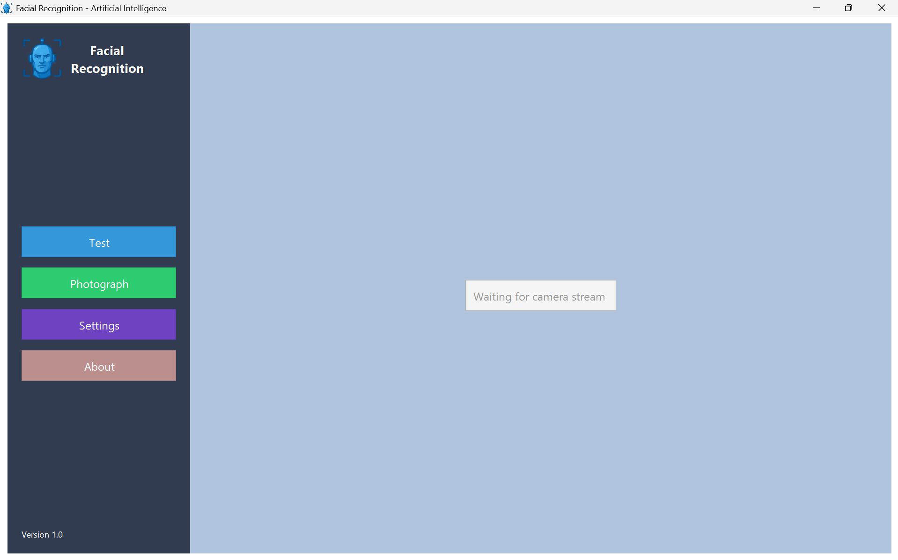

# Face Recognition AI Application (Java)

## Coursework Context:

This project was developed as part of the Artificial Intelligence and Optimization course at the **Faculty of Mathematics**, specialization **Mathematics and Computer Science**, **University Alexandru Ioan Cuza in Iași**.

## Description

A real-time face recognition system built in Java using Support Vector Machines (SVM) and OpenCV for camera access.  
Custom training and recognition algorithms are implemented without relying on external machine learning libraries.  
Supports multi-person recognition with dynamic dataset creation and real-time detection.

## Features

- Real-time face detection and recognition
- Uses SVM for classification
- Custom training algorithm without external ML libraries
- Supports multiple people and dynamic dataset creation
- Interactive GUI with buttons: "Test", "Photograph", "Settings", "About"
- Photo editing and deletion functionality
- Displays training percentage
- Live detection with green bounding boxes and names above faces

## Dependencies

OpenCV 4.x
This project uses **OpenCV** for real-time video capture.
Official website: **https://opencv.org/**

## OpenCV Setup

1. Download OpenCV for Windows from [https://opencv.org/](https://opencv.org/).
2. Place the OpenCV DLL in the `native` folder, e.g., `native/opencv_java<version>.dll`.
3. Place the OpenCV JAR in the `native/lib` folder, e.g., `native/lib/opencv-<version>.jar`.

4. Update `App/CaptureManager.java`->`System.loadLibrary("opencv_java<version>")` with your actual OpenCV version. 

## Prerequisites

- Java JDK 8 or higher installed
- OpenCV library for Java configured
- Webcam connected to your system
- Windows OS (for running batch files)

## Compile the Application

- Create Build Directory: Ensure a folder named build exists to store compiled files

- Generate the source list:  
   `dir /s /b src\*.java > sources.txt`
- Compile the project:  
   `javac -cp ".;native/lib/opencv-<version>.jar" -sourcepath src -d build @sources.txt`

- The project cannot be compiled unless the **OpenCV setup** has been completed.

## Training a New Model

You can generate your own SVM model by providing custom positive and negative samples.  
Follow the steps below to prepare your dataset and run the training process.

### 1. Compile the Application

Ensure the project is compiled before training.  

### 2. **Prepare the Training Dataset**

#### Positive Samples (Faces)
Place face images in: `data/train/detection/pos/`
#### Negative Samples (Non-Faces)
Place non-face images in:`data/train/detection/neg/`

### 3. **(Optional) Prepare Test Samples**

You may evaluate the model by placing test images in: `data/test/pos/` and `data/test/neg/`

### 4. **Run the Training Script**

Run the training process

`java -cp "build;native/lib/opencv-<version>.jar" -Djava.library.path=native facedetection.Detection.FaceDetectionApp --train   
` . 

This will:
- load and preprocess the dataset  
- extract HOG feature vectors  
- train the SVM classifier  
- evaluate the model (optional)  
- generate the `SvmFile/svm_model.ser` file  

You can also:
Evaluate the model accuracy by running 
 `java -cp "build;native/lib/opencv-<version>.jar" -Djava.library.path=native facedetection.Detection.FaceDetectionApp --accuracy   
 `.

## Application-Specific Prerequisites
- Make sure to update `<version>` with the version of OpenCV you have downloaded.
- See the **OpenCV Setup** section for instructions on how to update your OpenCV version.

- Make sure the file `svm_model.ser` is added in the `SvmFile` folder. This model is required for face detection.
- The trained SVM model file (`SvmFile\svm_model.ser`) is not included due to privacy reasons.
- You can see how to generate a new model in the **Training a New Model section below**.

## Run the Application

Run:

`java -cp "build;native/lib/opencv-<version>.jar" -Djava.library.path=native facedetection/App/WebcamCaptureApp 
`

The GUI window will open with buttons: "Test", "Photograph", "Settings", "About"

  

## Using the Application

- Click **Photograph** → then **Start** to take photos of at least two people.
- After pressing **Start**, add the name of each person.
- You can edit or delete photos using the provided buttons.
- After photographing at least two people, click **Test**.
  - A table will appear showing the training percentage.
- Once training reaches 100%, the webcam feed will open:
  - Each detected face will be highlighted with a **green bounding box**.
  - The **name of the recognized person** will be displayed above the bounding box in real-time.

## Generate Project Documentation

The project documentation was created using **Javadoc**.  
To generate the documentation:

1. Compile the project.

2. Prepare the directory:
`if not exist Docs mkdir Docs`

3. Run Javadoc:
`javadoc -cp ".;native/lib/opencv-<version>.jar" -d Docs -sourcepath src -private @sources.txt
`, 

 which produces a folder `Docs` with  HTML documentation for all classes, methods, and fields, providing a detailed overview of the project structure and functionality.

## Credits

- The project logo was generated using AI-based graphic tools.

## License

This project is licensed under the MIT License. See the `LICENSE` file for details.
